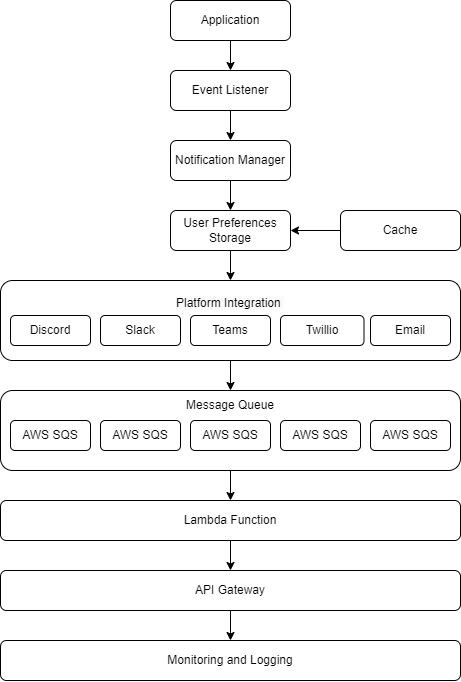

# Notification System Architecture
This document will provide the architecture design for the notification system.

## Components of the system
* Event listener – create an event listener to listen for notes to be created within the application.
* Notification Manager – starts the notification process, such as by looking up the users preferred channel, formatting the notification, and sending the notification.
* Platform Integrations - sends the notification to the user’s platform of choice (Discord, Slack, Microsoft Teams, Twilio, and Email).
* User Preferences Storage - stores the users channel preference and platform-specific configuration details. Implemented using DynamoDB.
* Cache - caches the users’ preferences to reduce storage and improve the systems processing time. Implemented using Redis.
Lambda - processes the notification and sends them to the channels.
* API Gateway - secure and scalable way to send the lambda functions as HTTPS endpoints. This allows the notification manager to send the notification to the platforms via restful API.
* Monitoring & Logging – monitors the performance of the notification system to ensure function ability.

## Architecture Diagram

## Workflow
* Note is created within the application.
* Event listener detects the note creation event and sends it to the notification manager.
* The notification manager retrieves the user’s preferences from the cache.
* If the preference is not there, then it will look for them within the database and update the cache.
* The notification is formatted, and API gateway endpoints are added.
* Lambda functions sends the notification to the channel.

## Scalability Considerations
* Message Queues – message queues to handle increases in volumes to the application.
* Caching - Cache user preferences to reduce storage and improve the notification systems speed.
* Serverless Architecture - Lambda will automatically scale with the volume.

## Security and Reliability Considerations
* Rate Limiting - to the API Gateway endpoints to prevent abuse.
* Circuit Breaker - to handle failures and prevent them in the future.
* Backup & Recovery - Set up regular backups for the storage and cache.

## Next Steps
* Define the API for event listener, notification manager and platform integration.
* Create data models for the users’ preferences.
* Error handling created for platform integration. 
* Testing strategy created to ensure reliability.
* Deployment process created.
* Monitoring, logging, and alert system created.